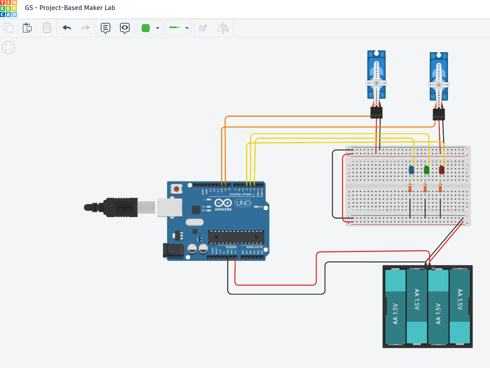
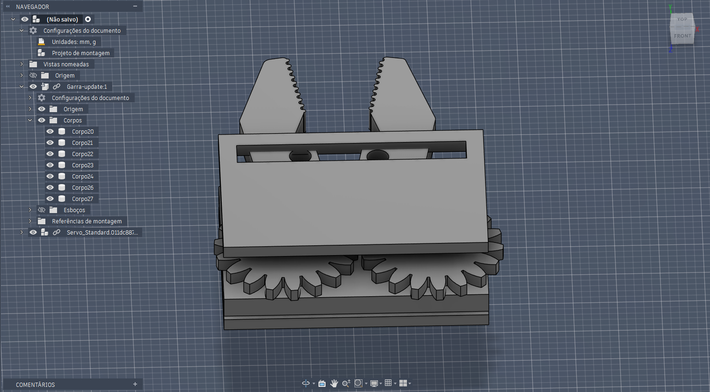
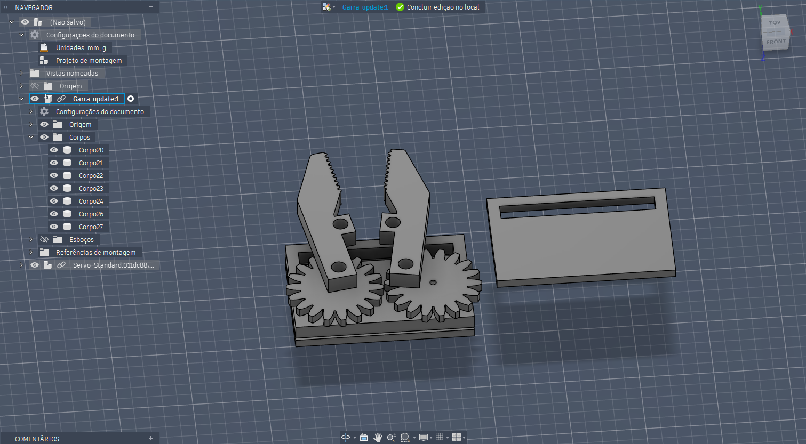
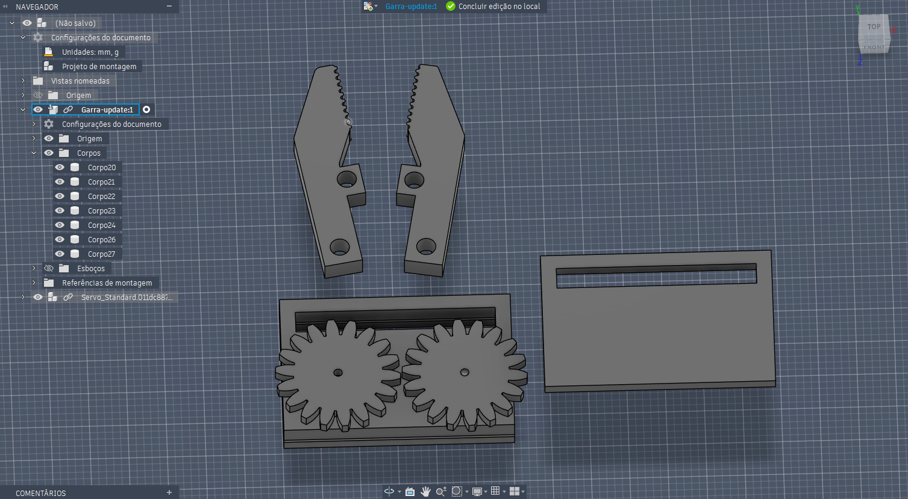
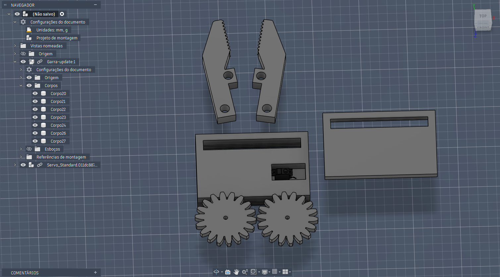

# 🚀 Braço Robótico de Coleta de Amostras Espaciais (Docking & Retrieval)

## Integrantes

- Gustavo Henrique Santos Bonfim - RM98864
- João Pedro Marques – RM98307
- Kayky Paschoal Ribeiro - RM99929
- Lucas Yuji Farias Umada - RM99757
- Natan Eguchi dos Santos - RM98720

---

## 📋 Descrição do Projeto

Este projeto consiste no desenvolvimento de um braço robótico para coleta de amostras em ambientes simulados de microgravidade, inspirado em aplicações da Indústria Espacial.

O sistema utiliza um Arduino Uno, dois servomotores SG90 responsáveis pela movimentação do braço e da garra, além de três LEDs indicadores que fornecem feedback visual sobre o estado do sistema.
O controle é realizado através do Monitor Serial da IDE Arduino, permitindo movimentar o braço robótico por meio dos comandos U (Up), D (Down), O (Open) e C (Close).

Os LEDs auxiliam na operação:
- LED Azul: sistema ligado;
- LED Verde: movimentação do braço;
- LED Vermelho: abertura e fechamento da garra.

Além do circuito eletrônico, foi desenvolvida uma peça mecânica em 3D representando a garra de coleta utilizada para capturar amostras espaciais.

---

## 🔗 Acesso ao Simulador

Link do projeto Wokwi/Tinkercad:

**https://www.tinkercad.com/things/2dF0SFH0UGh/editel?returnTo=%2Fdashboard&sharecode=W8iKYjWrqEKOzBi3EUI2qvpLuQMSNUEMb8rRj9uE2E8**

---

## 🎮 Guia de Operação

Após iniciar a simulação e abrir o Monitor Serial, utilize os seguintes comandos:

| Comando | Função | LED Acionado |
|----------|----------|----------|
| U | Move o braço para cima | LED de Movimento |
| D | Move o braço para baixo | LED de Movimento |
| O | Abre a garra | LED da Garra |
| C | Fecha a garra | LED da Garra |

### Indicação dos LEDs

| LED | Função |
|------|---------|
| LED Azul (Sistema) | Permanece ligado indicando que o sistema está ativo |
| LED Verde (Movimento) | Acende durante a movimentação do braço robótico |
| LED Vermelho (Garra) | Acende durante a abertura ou fechamento da garra |

### Exemplo de utilização

1. Abrir o Monitor Serial.
2. Configurar a taxa de comunicação para 9600 baud.
3. Digitar um dos comandos disponíveis.
4. Observar a movimentação dos servomotores e o acionamento dos LEDs correspondentes.

---

## 🛠️ Software de Modelagem

A modelagem 3D do projeto foi desenvolvida utilizando o software **Autodesk Fusion 360**.

Foram criadas peças mecânicas para compor o sistema de coleta do braço robótico, incluindo a garra principal solicitada pela atividade e componentes adicionais desenvolvidos para complementar o mecanismo de movimentação.

Os arquivos do projeto encontram-se na pasta `/model`, incluindo:

- Arquivo nativo de modelagem (`.f3d`)
- Arquivo exportado para impressão 3D (`.stl`)

---

## 🔩 Modelagem 3D Desenvolvida

A atividade solicitava o desenvolvimento da **garra robótica (Grip)** responsável pela captura de amostras espaciais.

Para atender ao requisito, foram modeladas as seguintes peças:

### Peças Obrigatórias

- Garra esquerda
- Garra direita

As garras possuem dentes de contato para melhorar a aderência ao objeto coletado e furos de fixação para integração ao mecanismo de acionamento.

### Peças Adicionais Desenvolvidas

Além da garra solicitada, foram desenvolvidos componentes extras para demonstrar o funcionamento mecânico do sistema:

- Duas engrenagens sincronizadas
- Base estrutural inferior
- Tampa de proteção superior
- Suporte para acomodação do servomotor SG90
- Sistema de transmissão entre servo e garras

### Funcionamento Mecânico

O servomotor aciona uma das engrenagens do conjunto.

As engrenagens trabalham de forma sincronizada, convertendo o movimento rotacional do servo em movimento simétrico das duas garras, permitindo a abertura e fechamento para captura de objetos.

### Objetivo da Modelagem

O conjunto foi projetado para simular uma garra robótica utilizada em missões espaciais para:

- Coleta de amostras
- Manipulação de objetos
- Operações de docking e retrieval
- Captura de pequenos componentes em ambientes de microgravidade

A modelagem foi desenvolvida considerando simplicidade construtiva, facilidade de fabricação por impressão 3D e integração com servomotores SG90 utilizados no protótipo eletrônico.

---

## ⚙️ Especificações Técnicas

### Alimentação

- Arduino Uno alimentado via USB
- Fonte externa composta por 4 pilhas AA (6V)
- Servomotores alimentados por fonte dedicada de 6V
- GND da fonte compartilhado com o Arduino

### Componentes Utilizados

- Arduino Uno
- 2 Servomotores SG90 (9g)
- 1 LED Azul (Status do Sistema)
- 1 LED Verde (Movimentação do Braço)
- 1 LED Vermelho (Abertura e Fechamento da Garra)
- 3 Resistores de 220 Ω
- Protoboard
- Fonte de alimentação externa (6V)
- Jumpers

### Pinagem Utilizada

| Componente | Pino Arduino |
|------------|-------------|
| Servo da Garra | D9 |
| Servo do Braço | D10 |
| LED Sistema (Azul) | D2 |
| LED Movimento (Verde) | D3 |
| LED Garra (Vermelho) | D4 |

### Comunicação Serial

- Baud Rate: **9600 bps**

---

## 📂 Estrutura do Repositório

```text
/
├── src/
│   └── projeto.ino
│
├── model/
│   ├── garra.f3d
│   └── garra.stl
│
├── images/
│   ├── circuito.png
│   ├── componentes_modelagem_3d.png
│   ├── estrutura_interna_servo.png
│   ├── garra_montada_completa.png
│   └── vista_explodida_conjunto.png
│
└── README.md
```

---

## 📸 Evidências

### Circuito Eletrônico



### Garra Robótica Montada



### Vista Explodida do Conjunto



### Componentes Modelados



### Estrutura Interna e Suporte do Servo



---

## 🌌 Contexto Espacial

O projeto foi inspirado em sistemas robóticos utilizados em missões espaciais para captura de amostras, manutenção de equipamentos em órbita e operações de docking.

O mecanismo desenvolvido simula o funcionamento de uma garra robótica capaz de manipular objetos remotamente em ambientes de difícil acesso, reproduzindo conceitos utilizados em missões de exploração espacial e coleta de materiais extraterrestres.
